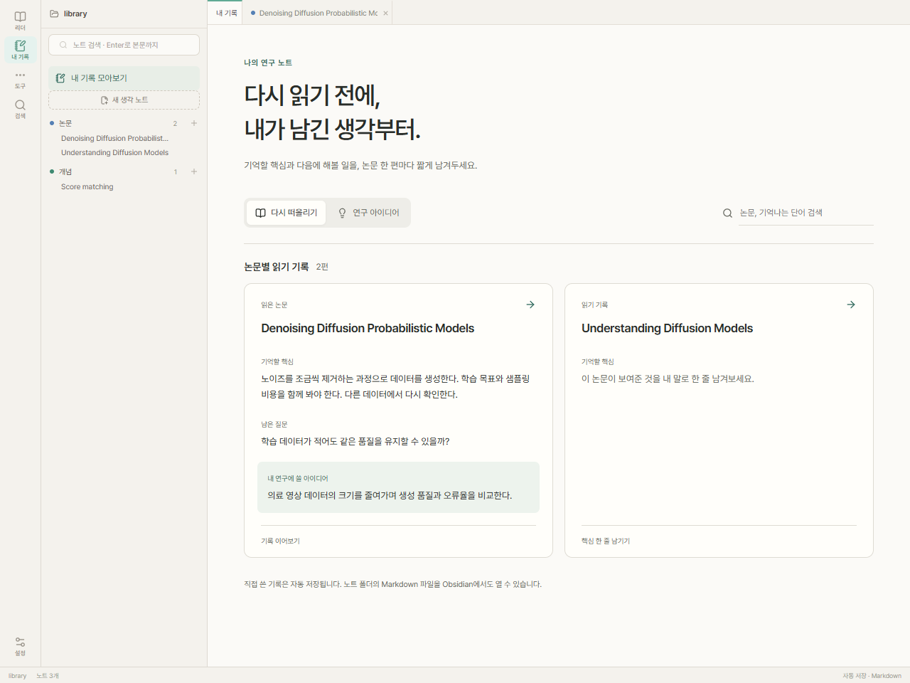
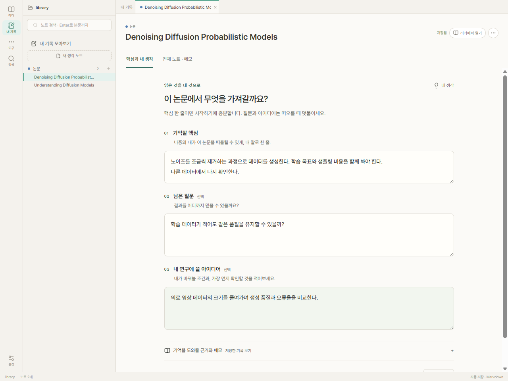

# 노트: 기록에서 회상과 다음 연구로

2026-09-12 · `codex/notes-recall-flow` · 기준 `origin/main`의 `c865137`

## 해결하려는 문제

논문을 잊었을 때 노트가 도움이 되지 않으면 결국 원문을 다시 읽게 된다. 기존 화면은 노트 종류, 관계, 큐레이션, 모델 설정을 먼저 보여줬고, 논문 노트도 자동 기록과 메모가 길게 이어져 사용자가 무엇을 남기면 좋을지 파악하기 어려웠다.

새 흐름은 한 편에서 기억할 문장을 남기고, 이후 그 문장과 질문을 바로 다시 보는 데 집중한다. 실제 사용자 연구로 효용을 입증했다는 의미는 아니며, 아래는 구현과 재현 가능한 검사 결과다.

## 사용 흐름

1. 리더의 **읽기 노트**를 연다.
2. **기억할 핵심**에 내 말로 한 줄을 남긴다. **남은 질문**, **내 연구에 쓸 아이디어**는 선택 사항이다. 아이디어 입력은 바꿔볼 조건과 첫 검증 행동을 생각하도록 돕는다.
3. **내 기록**의 논문 카드에서 그 문장을 다시 읽는다. 제목과 남긴 생각을 검색할 수 있다.
4. **연구 아이디어**로 전환하면 질문 또는 적용 아이디어를 남긴 논문만 모인다. 카드에서 원래 논문 기록으로 돌아간다.
5. 자세한 내용이 필요할 때만 근거를 펼치거나 전체 노트를 연다. 저장 블록을 지정한 이동은 전체 편집기의 정확한 블록으로 이어진다.

화면의 기본값에서 연결 패널, 빈 노트 분류, 정리 대기 수, AI 모델 선택을 덜어냈다. 기존 도구는 도구 메뉴와 설정에서 사용할 수 있다. 빈 입력칸은 파일에 양식으로 쓰이지 않는다.

## 저장과 호환성

- 카드 내용은 저장된 내 생각 영역에서 추출한다. AI가 작성한 요약을 사용자 생각으로 표시하지 않는다. 새 AI 호출은 필요하지 않다.
- 논문의 개인 영역에 `restate`를 추가했다. 기존 `unresolved`와 `apply`는 그대로 사용한다.
- `paperRecall.ts`는 선택한 개인 영역만 수정한다. 기존 제목을 사용하는 비표시 영역은 그 자리에서 표시 영역으로 바꾼다. 원문, 자동 기록, 다른 메모, 수식, 링크는 보존한다.
- 겹치거나 불완전한 개인 영역은 폼에서 쓰기를 거부하고 전체 노트를 안내한다. Markdown 코드 예시 안의 제목과 구간 표시는 개인 영역으로 취급하지 않는다.
- 입력 중 공백과 줄바꿈을 유지한다. 저장·포커스 이동·자동 저장이 겹쳐 생기던 가짜 외부 충돌은 문서별 저장 직렬화로 수정했다. 파일 감시는 진행 중인 자신의 저장 결과를 외부 편집으로 처리하지 않는다. 실제 외부 변경에는 기존 버전 검사를 유지한다.

## 검증

- `npm run build`: TypeScript 및 배포 빌드.
- `node scripts/run-core-tests.mjs`: 기존 핵심 계약과 새 회상 노트 계약.
- `node scripts/test-recall-ui.mjs`: 격리한 실제 Electron 앱에서 한국어 입력, 빠른 입력칸 이동, 공백·줄바꿈, 자동 저장, 닫고 다시 열기, 읽음 상태, 홈 카드, 아이디어 필터, 전체 편집, 리더 블록 이동, 라이트·다크·좁은 창을 검사한다.
- `node scripts/smoke-notes-ui.mjs`: 기존 Markdown 편집·근거·관계·저장 이력·충돌·Obsidian 흐름. 전체 편집을 검사하는 시나리오는 이제 명시적으로 전체 노트를 선택한다.

화면 캡처는 `tmp/ui/recall/`에 생성된다. 내용은 테스트용 기록이며 실제 논문 분석 결과가 아니다.

## 확인할 사용성 가설

처음 쓰는 사람이 설명 없이 핵심 한 줄을 남길 수 있는지, 며칠 후 카드만 보고 논문을 떠올릴 수 있는지, 질문을 다음 실험으로 구체화하는 데 도움이 되는지는 실제 사용에서 확인해야 한다. 자동 회상 일정이나 AI 연구 아이디어 생성은 이번 변경에 포함하지 않았다.
